# ChatGPT2API

> 支持文生图、图生图编辑、多图合成，模型包括非常强大的 gpt-image-2，并且还没有某包那样的水印


提供账号池管理，Docker 一键部署


**项目地址：** <https://github.com/basketikun/chatgpt2api>

---

## 服务器推荐

推荐服务器部署，不要选择国内地区，选择 Linux 版本 Docker 上手快。

腾讯云新加坡 / 硅谷 / 东京地区价格是 **199 元一年**，2 核 4G 30M 带宽，60GB SSD 盘 1.5T 月流量，推荐硅谷地区 CN2 线路，系统选 Ubuntu 24。

**购买地址：** <https://curl.qcloud.com/oyWDLkRJ>

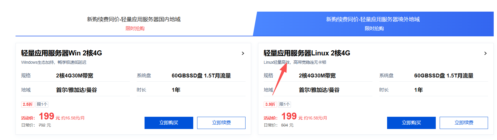

---

## 部署教程

### 1. 安装 Docker

```bash
sudo apt update
sudo apt install -y ca-certificates curl gnupg
sudo install -m 0755 -d /etc/apt/keyrings
curl -fsSL https://download.docker.com/linux/ubuntu/gpg | sudo gpg --dearmor -o /etc/apt/keyrings/docker.gpg
sudo chmod a+r /etc/apt/keyrings/docker.gpg
echo \
"deb [arch=$(dpkg --print-architecture) signed-by=/etc/apt/keyrings/docker.gpg] https://download.docker.com/linux/ubuntu \
$(. /etc/os-release && echo "$VERSION_CODENAME") stable" | \
sudo tee /etc/apt/sources.list.d/docker.list > /dev/null
sudo apt update
sudo apt install -y docker-ce docker-ce-cli containerd.io docker-buildx-plugin docker-compose-plugin
sudo docker run hello-world
```

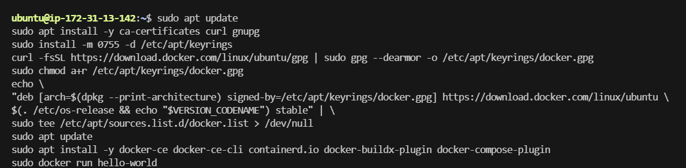

### 2. 下载项目

```bash
git clone https://github.com/basketikun/chatgpt2api.git
```

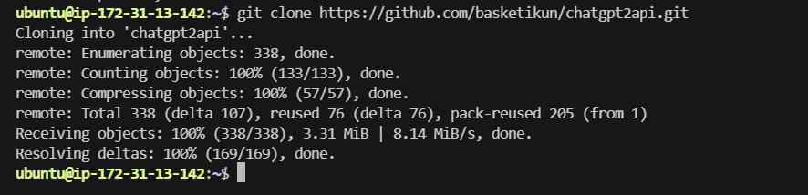

### 3. 打开项目

```bash
cd chatgpt2api
```

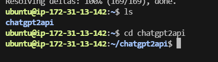

### 4. 运行

```bash
sudo docker compose up -d
```

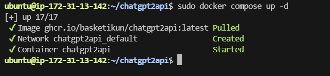

### 5. 打开浏览器访问

```
http://你的服务器公网IP:3000
```

> **注意：** 记得防火墙放通 3000 端口

密钥是：`chatgpt2api`

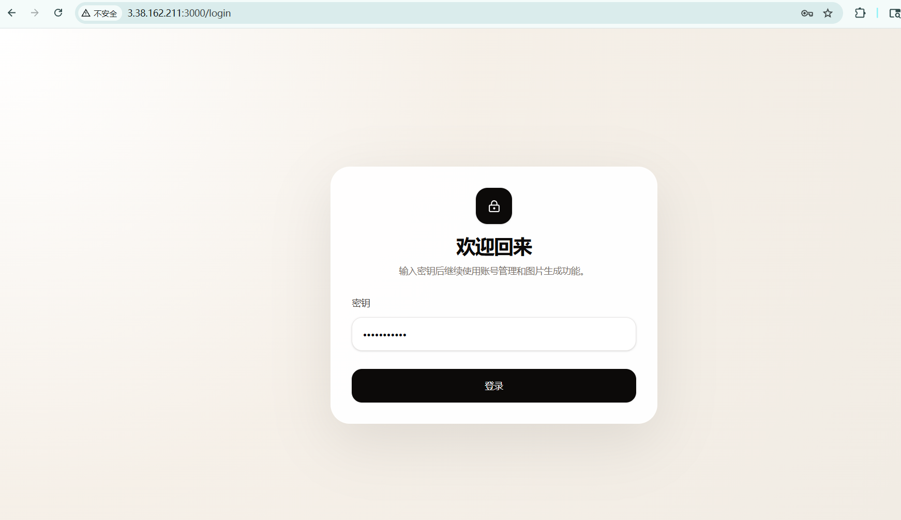

### 6. 导入账号

选择：**导入 Session JSON**


### 7. 获取 accessToken

打开以下地址，复制页面返回的完整 JSON，系统会自动提取其中的 `accessToken`：

```
https://chatgpt.com/api/auth/session
```

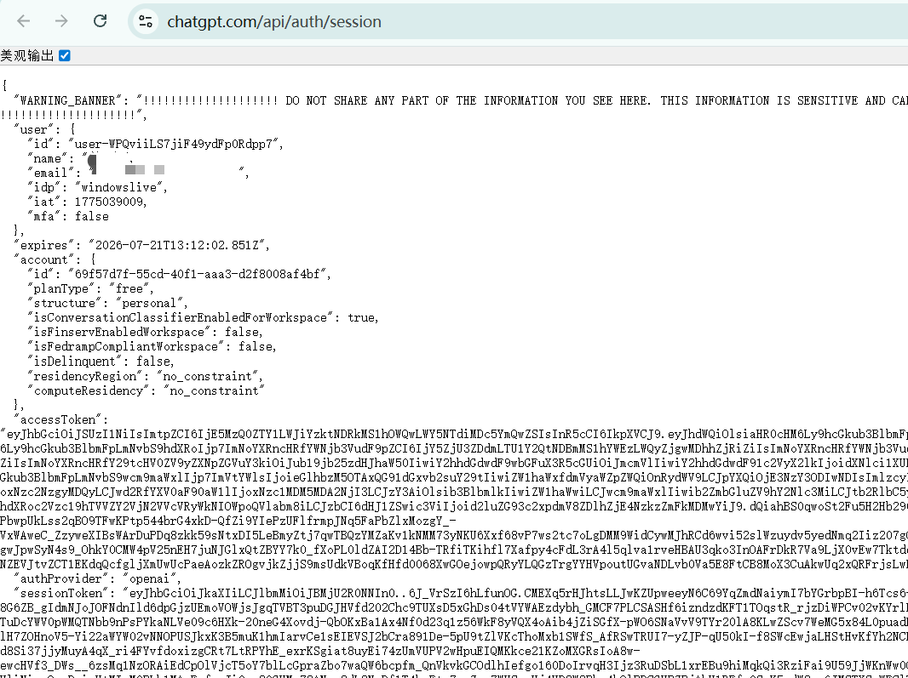

### 8. 导入成功

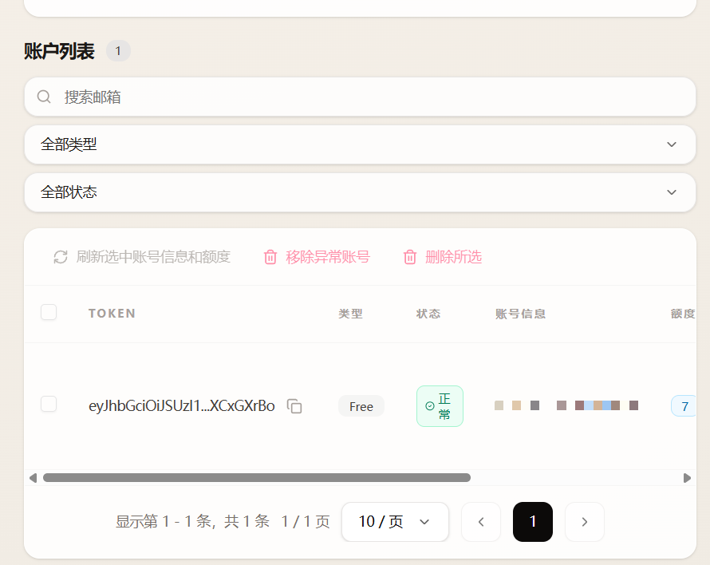

### 9. 点击顶部的画图

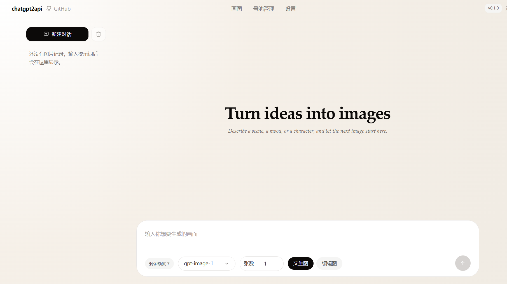

### 10. 切换模型

模型可以切换为 `gpt-image-2`，额度剩余 7

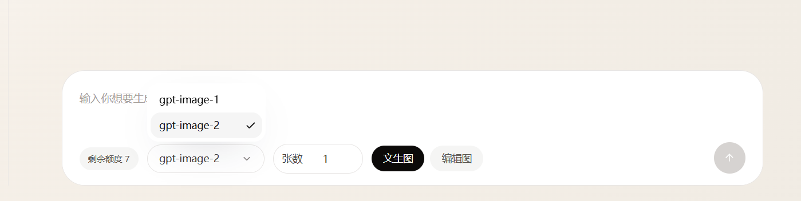

### 11. 效果展示

提示词：生成一个女生在抖音直播

效果非常强大

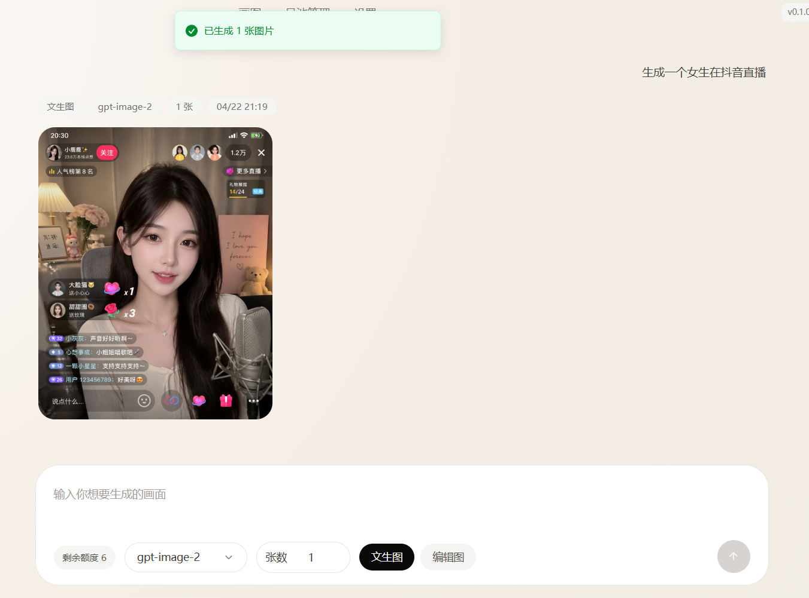


---

## API 调用

OpenAI 兼容图片生成接口，用于文生图：

```bash
curl http://localhost:8000/v1/images/generations \
  -H "Content-Type: application/json" \
  -H "Authorization: Bearer <auth-key>" \
  -d '{
    "model": "gpt-image-2",
    "prompt": "一只漂浮在太空里的猫",
    "n": 1,
    "response_format": "b64_json"
  }'
```

| 参数 | 值 |
| --- | --- |
| 模型 | `gpt-image-2` |
| 密钥 | `chatgpt2api` |

> 按需编辑 `config.json` 的密钥，编辑后需要重启 Docker
